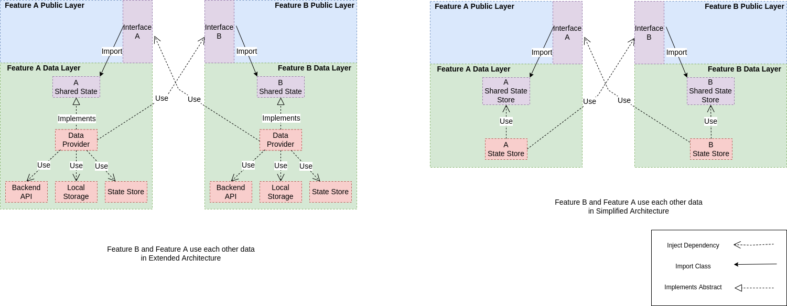

# ArchitectPoc

This is a showcase project for a ddd macro architecture implemented with nx and angular.

We have prepared two different approaches, each with different levels of abstraction.
The level of abstraction is the main driver for _maintainability_, _DX_ and _code complexity_.

You'll find the `simple layered architecture` [over here](https://github.com/svoren258/architect-poc)

## Extended Layered Architecture

### Design Decisions & Patterns

Focus on maximum inversion of control, level of abstraction and constraints.

* Separation of Concerns (domain driven feature libraries)
* Domain Driven Design
* Layered Architecture
* Adapter/Port Pattern


### Folder Structure and Constraints


```
dashboards/
    *domain/
        dashboard.model.ts
    *data/
      resource/
        dashboard.resource.ts <-- domain // does actual http calls
      store/
        dashboard.store.ts <-- domain // implements @ddd/dashboard/use-cases `DashboardFeatureState`
        dashboard-shared.store.ts <-- domain // implements @ddd/dashboard/data `DashboardSharedFeatureState`
      dashboard-shared.state.ts // `DashboardSharedFeatureState` abstract class defining shared feature-state
      tokens.ts // define tokens for: `DashboardFeatureState`, `DashboardSharedFeatureState`, `DashboardAdapter`
      index.ts
    *use-cases/
      ports/
        data/
          dashboard-feature.state.ts // `DashboardFeatureState`
        ui/
          dashboard.adapter.ts // `DashboardAdapter`
      dashboard-use-case.ts <-- @ddd/settings/public/state
        // implements @ddd/dashboard/use-cases `DashboardAdapter`
    public/
        *state
          public-dashboard-state.module.ts // `forRoot` defining @ddd/dashboard/data tokens.ts
          index.ts  // re-export domain, shared state

       *feature-list/
           list/
               feature-list.component.ts <-- @ddd/dashboard/uses-cases (`DashboardAdapter`)
           feature-list-module.ts

       *feature-show/
          show/
            feature-show.component.ts <-- @ddd/dashboard/uses-cases (`DashboardAdapter`)
          feature-show-module.ts

       *ui/
        components/
          ui-dashboard-list.component.ts (display only)
        patterns/
        tokens/
```


## Data Sharing and UI workflow Comparison




